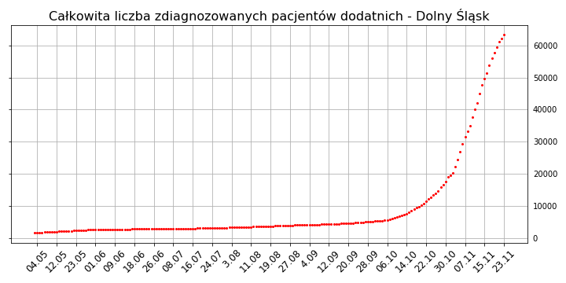
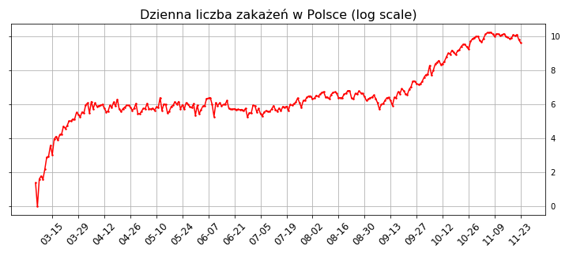

02.11.20r.

# Na Dolnym Śląsku (aktualne):

W wypadku Legnicy i Jeleniej Góry widzimy sumę diagnoz dodatnich z miasta i powiatu.

(Bolesławiec i Zgorzelec mają tylko powiat) 

# W Polsce (dane na wczoraj):

Aby lepiej zrozumieć tempo wzrostu dziennych zakażeń, zobaczmy jak to wygląda w skali logarytmicznej:

Dostrzegamy tu od mniej więcej drugiego tygodnia września wyraźny trend liniowy. Oznacza to, że mamy do czynienia ze wzrostem wykładniczym.

Możemy dopasować funkcję do tych danych, aby lepiej zrozumieć to zjawisko. Dla przeskalowanych danych wyznaczymy prostą regresji metodą najmniejszych kwadratów. 

Współczynnik R-kwadrat wynosi ok. 0.9776, zatem jest to dość dobrze dopasowany model.
