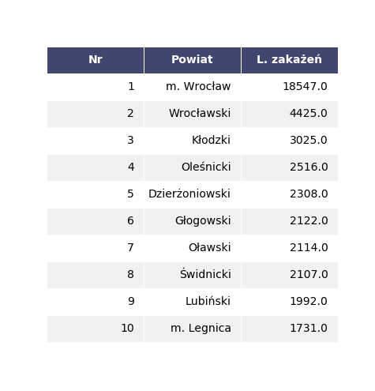
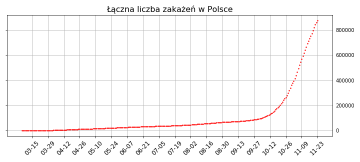

20.11.20r.

# Dolny Śląsk:

Na Dolnym Śląsku największe ognisko zakażeń znajduje się w stolicy województwa. We Wrocławiu wystąpiło kilkukrotnie więcej zdiagozowanych pacjentów z covidem niż w jakimkolwiek innym powiecie, dlatego jako wartość odstająca nie został uwzględniony na poniższym kartogramie.

Z takiej reprezentacji danych widzimy, że wciąż jest niemało powiatów, gdzie zdiagnozowano mniej niż tysiąc zakażeń. Po usunięciu miasta Wrocław wciąż wyróżnia się powiat wrocławski, który odstaje liczebnościowo od kolejnych jednostek administracyjnych.

Na tym wykresie dobitniej pokazana jest różnica między "liderami" w liczbie zakażeń. Co ciekawe p. wrocławski wyprzedził p. kłodzki dopiero na początku listopada.

Tutaj porównujemy inne wybrane jednostki administracyjne.

W wypadku Legnicy i Jeleniej Góry widzimy sumę diagnoz dodatnich z miasta i powiatu.

(Bolesławiec i Zgorzelec mają tylko powiat) 

Niestety, ale na Dolnym Śląsku tempo wzrostu liczby zakażeń zdaje się nie maleć w znaczący sposób.

# W Polsce:

Dane do wczoraj.

Tak prezentuje się całkowita liczba zdiagnozowanych zakażeń w czasie. Poniżej widać dziennie przyrosty:

Aby lepiej zrozumieć tempo wzrostu dziennych zakażeń, zobaczmy jak to wygląda w skali logarytmicznej:

Dostrzegamy tu od ok. 2. tygodnia września do 1. tygodnia listopada wyraźny trend liniowy. Oznacza to, że mamy do czynienia ze wzrostem wykładniczym.

Możemy dopasować funkcję do tych danych, aby lepiej zrozumieć to zjawisko. Dla przeskalowanych danych dopasujemy prostą regresji metodą najmniejszych kwadratów:

Współczynnik R-kwadrat (miara dopasowania wyznaczonej prostej regresji do danych) wynosi ok. 0.979, zatem jest to dobrze dobrany model i faktycznie w tym przedziale czasowym można mówić o wzroście wykładniczym liczby zdiagnozowanych dodatnio pacjentów.

Obecnie, według powyższych danych wynika, że wyszliśmy z tego trendu, ale należy mieć na uwadze, że na początku listopada ogłoszono zmiany w wytycznych dotyczących robienia testów, co mogło wpłynąć na zawężenie grupy testowanych ludzi. Niestety tezę, że robi się za mało testów potwierdza poniższy wykres: 

Widzimy tu ile procent wykonywanych testów ma wynik dodatni. Czerwoną linią wskazany jest poziom 5%, który w maju WHO uznało za 'zbyt wysoki', aby zacząć łagodzić zastosowane restrykcje sanitarne. Przez tak wysoki procent testów pozytywnych nie mamy pojęcia o prawdziwej skali zjawiska w naszym kraju, a zaprezentowane wcześniej dane moga stanowić jedynie ograniczenie z dołu omawianych charakterystyk. 

Więcej informacji w artykule: 

[www.jhsph.edu/covid-19/articles/covid-19-testing-understanding-the-percent-positive.html](https://www.jhsph.edu/covid-19/articles/covid-19-testing-understanding-the-percent-positive.html)

Na koniec widzimy liczbę zgonów pecjentów ze zdiagnozowanym covid-19 względem czasu. Należy pamiętać, że obserwowany wzrost śmertelności w Polsce w ostatnich miesiącach nie jest wytłumaczalny jedynie powyższymi danymi. 

Źródła danych:

[www.duw.pl/pl/dla-mediow/aktualnosci-covid-19](https://www.duw.pl/pl/dla-mediow/aktualnosci-covid-19)

[ourworldindata.org/coronavirus](https://ourworldindata.org/coronavirus/country/poland?country=~POL)

