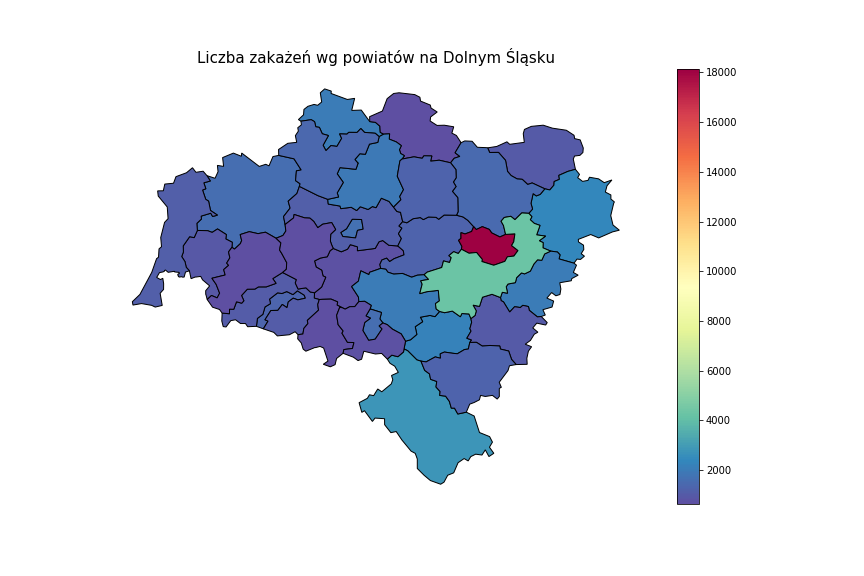
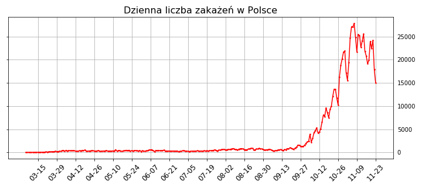
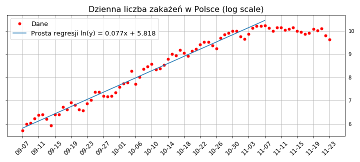
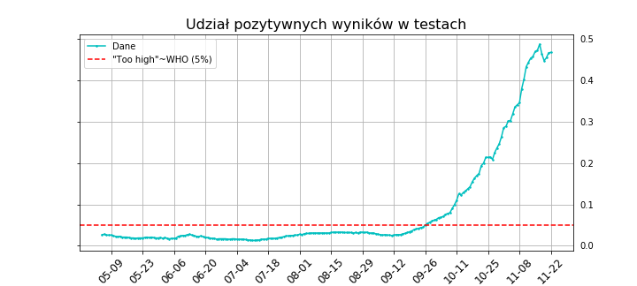

04.11.20r.

# Na Dolnym Śląsku:

W wypadku Legnicy i Jeleniej Góry widzimy sumę diagnoz dodatnich z miasta i powiatu.

(Bolesławiec i Zgorzelec mają tylko powiat) 

# W Polsce:

Tutaj mamy inny sposób oznaczenia danych

tj. data wskazująca na 2. października dotyczy informacji ogłoszonych przez ministerstwo 1. października. 

Aby lepiej zrozumieć tempo wzrostu dziennych zakażeń, zobaczmy jak to wygląda w skali logarytmicznej:

Dostrzegamy tu od ok. 2. tygodnia września wyraźny trend liniowy. Oznacza to, że mamy do czynienia ze wzrostem wykładniczym.

Możemy dopasować funkcję do tych danych, aby lepiej zrozumieć to zjawisko. Dla przeskalowanych danych wyznaczymy prostą regresji metodą najmniejszych kwadratów. 

Współczynnik R-kwadrat wynosi ok. 0.9756, zatem jest to dość dobrze dopasowany model.

Tutaj widzimy ile procent wykonywanych testów ma wynik dodatni. Czerwoną linią wskazany jest poziom 5%, który w maju WHO uznało za 'zbyt wysoki', aby zacząć łagodzić zastosowane restrykcje sanitarne. Więcej informacji w artykule: 

https://www.jhsph.edu/covid-19/articles/covid-19-testing-understanding-the-percent-positive.html

Źródła danych:

https://www.duw.pl/pl/dla-mediow/aktualnosci-covid-19

https://ourworldindata.org/coronavirus/country/poland?country=~POL
